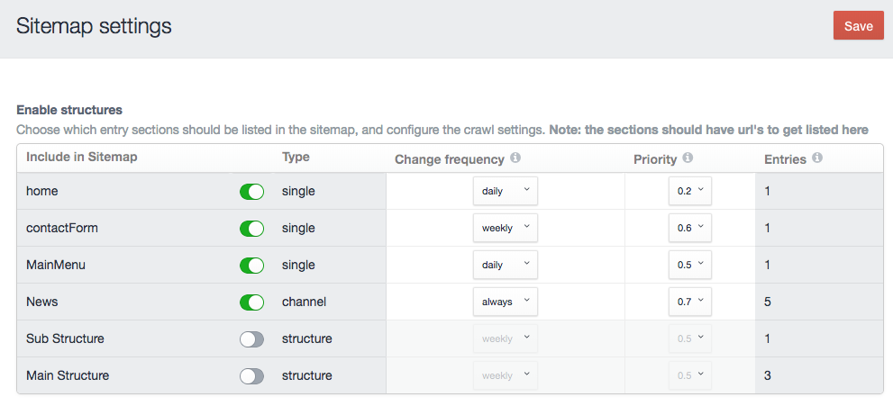

# XML-sitemap plugin for Craft CMS 3.x

Craft 3 plugin that provides an easy way to enable and manage a XML sitemap for search engines like Google and Bing



## Using the XML-sitemap plugin

After the installation, you can find the plugin in the settings section of the Control Panel.
You can enable and set the settings per entries section and enable categories in the sitemap.

After saving the desired settings, you can submit the xml url (your site url)/sitemap.xml to the searchengines.

## Sitemap structure
The sitemap is compatible with the [sitemaps.org](https://www.sitemaps.org/protocol.html) protocol.

In version 1.0.9 we added support for alternate languages to give [Google a better change to point to the correct page](https://support.google.com/webmasters/answer/2620865?hl=en).
```
  <url>
    <loc>https://othersite.local/news/news-item-1</loc>
    <priority>0.5</priority>
    <changefreq>weekly</changefreq>
    <lastmod>2018-02-21T21:09:47+01:00</lastmod>
    <xhtml:link rel="alternate" hreflang="en-gb" href="http://dev.craft/news/news-item-1"/>
    <xhtml:link rel="alternate" hreflang="en" href="https://othersite.local/news/news-item-1"/>
    <xhtml:link rel="alternate" hreflang="nl-nl" href="https://othersite.local/nl/news/news-item-1"/>
    <xhtml:link rel="alternate" hreflang="de-ch" href="https://othersite.local/ch/nachrichten/news-item-1"/>
  </url>
```
## Requirements

This plugin requires Craft CMS 3.0.0-RC11 or later.

## Installation

To install the plugin, follow these instructions.

1. Open your terminal and go to your Craft project:

        cd /path/to/project

2. Then tell Composer to load the plugin:

        composer require dolphiq/sitemap

3. In the Control Panel, go to Settings → Plugins and click the “Install” button for XML sitemap.


## XML-sitemap Roadmap
- Settings to enable /disable and split the entries in the xml on a site basis (for multi site setup)
- User (custom) url entry section
- Provide a way hide entries from the list
- Add a Ping for search engines
- Display the last 20 visits from search engines


### Contributors & Developers
Johan Zandstra - info@dolphiq.nl
Brought to you by [Dolphiq](https://dolphiq.nl)
